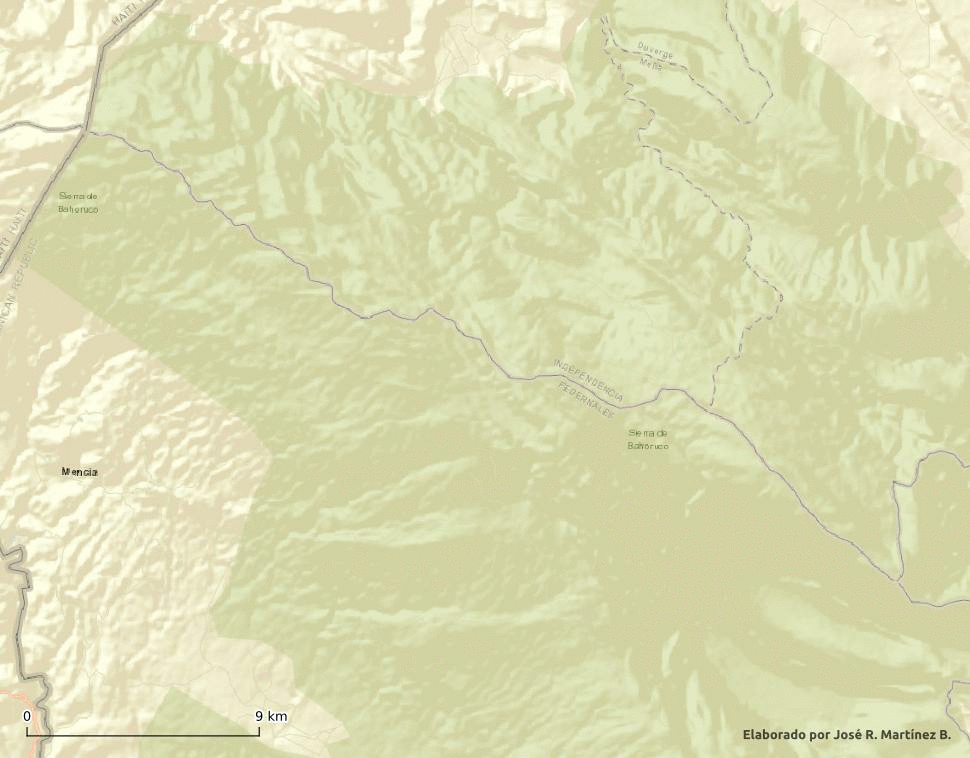

Incendio de enero de 2022 en sierra de Bahoruco, República Dominicana
================
José Ramón Martínez Batlle

-   Tw: @geografiard
-   GitHub: geofis

<!-- README.md is generated from README.Rmd. Please edit that file -->

## Estimación de superficie afectada por medio de interpretación visual

El GIF muestra una interpretación visual de la superficie afectada por
el incendio que inicio en Bahoruco el 29 de diciembre de 2021 y que
culminó el 31 de enero de 2022. Uso como referencia dos escenas del
satélite Sentinel 2 (prefuego, 19 de diciembre de 2021; posfuego, 28 de
enero de 2022), visualizadas como composiciones en falso color del
infrarrojo de onda corta. Dado que se trata de una interpretación
visual, el error es muy grande, pero la estimación sugiere que se trata
de un área afectada bastante grande.

El área afectada estimada, con muchísimo margen de error y abarcando
superficies de muy variada severidad de quemado (y posiblemente otras
sin quema), **ronda los 100 km2**. En la estimación tiene
mayor peso el foco oriental, por su tamaño y porque su impacto en el
terreno se define mucho mejor. El foco occidental no se define muy bien,
debido a la nubosidad y el humo persistentes. Otro aspecto que aumenta
la incertidumbre es el hecho de que, dentro del área abarcada en el foco
oriental, hay muchas “islas” que al parecer no resultaron afectadas.

Para despejar dudas, lo razonable sería realizar interpretación digital
usando el índice de quema normalizado y la severidad de quemado, pero
con imágenes “limpias”. Para ello, servirían tanto imágenes Sentinel 2
como Landsat 8 (quién sabe si Landsat 9 nos envíe alguna). Las imágenes
de Planet podrían ayudar, pero tienen muchas nubes; también las imágenes
de sensores ópticos de alta resolución temporal y baja resolución
espacial (VIIRS, MODIS, GOES-16), pero la incertidumbre sería igualmente
grande. La tecnología InSAR podría servir, pero suele ser efectiva en
donde predomina la alta severidad de quemado, lo cual no parece sea el
caso en este incendio.
