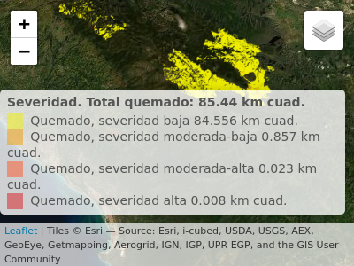

Incendio de enero de 2022 en sierra de Bahoruco, República Dominicana
================
José Ramón Martínez Batlle

-   Tw: @geografiard
-   GitHub: geofis

<!-- README.md is generated from README.Rmd. Please edit that file -->

## Actualización 5 de marzo de 2022: Severidad de quemado mediante razón de quema normalizada diferencial (dNBR)

Nota: mapa interactivo en la [versión
HTML](https://geofis.github.io/fuego-bahoruco-202201/README.html) de
este documento.

Usando escenas Landsat 9 (prefuego, 30/dic/2021) y Landsat 8 (posfuego,
24/feb/2022), y aplicando una versión modificada del [*script* Google
Earth Engine de UN-Spider “BURN SEVERITY MAPPING USING THE NORMALIZED
BURN RATIO
(NBR)”](https://un-spider.org/advisory-support/recommended-practices/recommended-practice-burn-severity/burn-severity-earth-engine),
realicé un análisis de la severidad de quemado en dicho incendio usando
el diferencial del índice normalizado de quema (dNBR). Adapté el
*script* fuente a la colección más reciente de imágenes Landsat 8 y 9.
La web está repleta de recursos sobre esta técnica, recomiendo [esta
particularmente](https://un-spider.org/es/node/10959). Como resultado
del análisis aplicado a la sierra de Bahoruco, estimé unos 85
km<sup>2</sup> de superficie quemada, predominantemente de baja
severidad. A continuación, muestro el código de análisis y visualización
de R.

### Paquetes

``` r
library(raster)
## Loading required package: sp
library(leaflet)
library(sf)
## Linking to GEOS 3.10.1, GDAL 3.4.0, PROJ 8.2.0; sf_use_s2() is TRUE
dnbr <- raster('data/dNBR-dic30-feb24.tif')
```

### Mapa de severidad de quemado (dNBR) generado en EarthEngine.

-   Código de EarthEngine
    [aquí](https://code.earthengine.google.com/?scriptPath=users%2Fjoseramon%2Fpublic%3Aburn-severity-bahoruco-2022).

-   Para aplicar a una cuenta de EarthEngine, [rellenar formulario de
    aplicación](https://signup.earthengine.google.com/#!/).

``` r
aoi <- st_read('data/area-de-interes.gpkg')
## Reading layer `area-delimitada' from data source 
##   `/home/jose/Documentos/git/fuego-bahoruco-202201/data/area-de-interes.gpkg' 
##   using driver `GPKG'
## Simple feature collection with 2 features and 0 fields
## Geometry type: MULTIPOLYGON
## Dimension:     XY
## Bounding box:  xmin: -71.74968 ymin: 18.12353 xmax: -71.39597 ymax: 18.29083
## Geodetic CRS:  WGS 84
dnbr_aoi <- mask(dnbr, aoi)
dnbr_utm <- projectRaster(dnbr_aoi, crs = CRS('EPSG:32619'))
```

### Rangos/matriz, reclasificar imagen dNBR

``` r
rangos <- c(
  -Inf, -500, -1,
  -500, -251, 1,
  -251, -101, 2,
  -101, 99, NA,
  99, 269, 4,
  269, 439, 5,
  439, 659, 6,
  659, 1300, 7,
  1300, Inf, -1) 
rclmat <- matrix(rangos, ncol = 3, byrow = TRUE)

# Reclasificar
dnbr_rcl <- reclassify(dnbr_utm, rcl = rclmat, right=NA)
```

### Tabla de atributos, leyenda, colores

``` r
# Tabla de atributos
dnbr_rcl <- ratify(dnbr_rcl)
rat <- levels(dnbr_rcl)[[1]]

# Resolucion (en km2)
resol <- res(dnbr_rcl)[1]*res(dnbr_rcl)[2]/1000000

# Etiquetas
etiq <- c('Regenerado, alto', 'Regenerado, bajo', 
          'No quemado', 'Quemado, severidad baja', 'Quemado, severidad moderada-baja', 
          'Quemado, severidad moderada-alta', 'Quemado, severidad alta')
etiq_validas <- rat$ID

# Leyenda y colores
valores_val <- round(table(dnbr_rcl[])[names(table(dnbr_rcl[])) %in% etiq_validas]*resol, 3)
rat$leyenda  <- paste(
  etiq[etiq_validas],
  valores_val,
  'km cuad.')
levels(dnbr_rcl) <- rat

# Raster sólo quemado
dnbr_rcl_q <- dnbr_rcl
dnbr_rcl_q[dnbr_rcl_q %in% grep('quemado', etiq[etiq_validas], ignore.case = T, invert = T)] <- NA
editar_slot <- slot(dnbr_rcl_q@data, 'attributes')[[1]]
slot(dnbr_rcl_q@data, 'attributes')[[1]] <- editar_slot[grep('quemado', editar_slot$leyenda, ignore.case = T), ]
slot(dnbr_rcl_q@data, 'attributes')[[1]]$leyenda <- factor(slot(dnbr_rcl_q@data, 'attributes')[[1]]$leyenda, levels = slot(dnbr_rcl_q@data, 'attributes')[[1]]$leyenda)
valores_quemado <- round(table(dnbr_rcl_q[])*resol, 3)
colores <- c("yellow2", "orange2", "#ff5425", "#d7191c")
# colores_todos <- c("#abdda4", "#f1f9bb", "#ffeba8", "yellow2", "orange2", "#ff5425", "#d7191c")
```

### Mapa con leaflet

-   Versión interactiva
    [aquí](https://geofis.github.io/fuego-bahoruco-202201/README.html)

``` r
leaflet() %>%
  addTiles(group = 'OSM') %>%
  addProviderTiles("Esri.NatGeoWorldMap", group="ESRI Mapa") %>%
  addProviderTiles("Esri.WorldImagery", group="ESRI Imagen") %>%
  addProviderTiles("CartoDB.Positron", group= "CartoDB") %>%
  addRasterImage(dnbr_rcl_q, colors = colores, group = 'Severidad') %>% 
  addLayersControl(
    overlayGroups = 'Severidad',
    baseGroups = c("ESRI Imagen", "OSM", "ESRI Mapa", "CartoDB")) %>%
  addLegend(
    title = paste(
      'Severidad. Total quemado:',
      round(sum(valores_quemado), 2),
      'km cuad.'),
    pal = colorFactor(colores, levels = slot(dnbr_rcl_q@data, 'attributes')[[1]]$leyenda, ordered = F),
    values = slot(dnbr_rcl_q@data, 'attributes')[[1]]$leyenda,
    position = 'bottomright') %>% 
  setView(
    lat = mean(extent(dnbr)[3:4])-0.1,
    lng = mean(extent(dnbr)[1:2]), zoom=10) %>% 
  suppressWarnings()
```



## Actualización 13 de febrero de 2022

Aunque no he podido dedicar mucho tiempo para hacer una actualización
más profunda, la imagen Sentinel 2 adquirida el 12 de febrero (ayer)
muestra que la superficie total afectada podría superar los 100
km<sup>2</sup>. Calculé unos 140 km<sup>2</sup>, pero se trata de una
estimación exagerada; estimo que el área final afectada se encontrará
entre los 100 km<sup>2</sup> y los 140 km<sup>2</sup>.


Destaco lo siguiente:

-   El área al norte de Pelempito (oeste de la depresión de río Arriba,
    norte de Aceitillar), quedó bajo nubosidad en esta imagen, por lo
    que la incertidumbre en dicha área es mayor que en la occidental.

-   Afortunadamente, una buena parte del área encerrada como “afectada”,
    presenta (a simple vista en las imágenes) severidad muy baja de
    quemado (sigo a la espera de poder hacer un análisis detallado de
    severidad de quemado).

-   Un área quemada “lineal”, de dirección sudoeste-nordeste, se hace
    visible en el sector occidental de Bahoruco.

## Estimación de superficie afectada por medio de interpretación visual


El GIF muestra una interpretación visual de la superficie afectada por
el incendio que inició en Bahoruco el 29 de diciembre de 2021 y que
culminó el 31 de enero de 2022. Uso como referencia dos escenas del
satélite Sentinel 2 (prefuego, 19 de diciembre de 2021; posfuego, 28 de
enero de 2022), visualizadas como composiciones en falso color del
infrarrojo de onda corta.

Dado que se trata de una interpretación visual, el error de la
estimación es grande, pero en principio se trata de una extensa área
afectada. La superficie afectada estimada, reitero, con mucho margen de
error, **ronda los 100 km<sup>2</sup>**. En la estimación tiene mayor
peso el foco oriental, por su tamaño y porque su impacto en el terreno
se define mucho mejor. El foco occidental no se define muy bien, debido
a la nubosidad y el humo persistentes. Otro aspecto que aumenta la
incertidumbre es el hecho de que, dentro del área abarcada en el foco
oriental, hay muchas “islas” que al parecer no resultaron afectadas.

Para despejar dudas, lo aconsejable sería realizar interpretación
digital usando el índice de quema normalizado y la severidad de quemado,
pero con imágenes “limpias”. Para ello, servirían tanto imágenes
Sentinel 2 como Landsat 8 (quién sabe si Landsat 9 nos envíe alguna).
Las imágenes de Planet podrían ayudar, pero todas están presentando
muchas nubes en la etapa posfuego; también serían de ayuda las imágenes
de sensores ópticos de alta resolución temporal y baja resolución
espacial (VIIRS, MODIS, GOES-16), pero la incertidumbre sería igualmente
grande. La tecnología InSAR podría servir, pero suele ser efectiva donde
predomina la alta severidad de quemado, lo cual no parece sea el caso en
este incendio.
